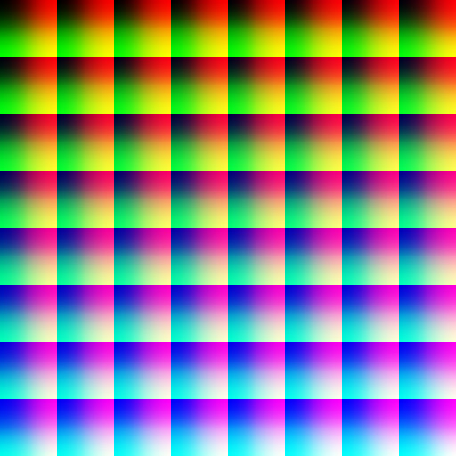

# LUTFilter-IOS

Light-weight and easy filter for image on IOS, driven by OpenGL and LUT.
[中文](./README_CN.md) | [English](./README.md)

## What is LUT

A Look-Up Table (LUT) is mathematically precise way of taking specific RGB image values form a source image – and modifying them to new RGB values by changing the hue, saturation and brightness values of that source image. A LUT can be scientifically precise (such as moving from the sRGB color space to the DCI P3 Color Space). A LUT can also be used creatively to impose a specific ‘Look’ on a source image, such as the Bleach Bypass look.

Intuitively, it's a picture looks like this:



A LUT has different size, 64 * 64 * 64 is used in this project.

## Requirement

IOS 10.0+
Swift 4+

## Installation

### CocoaPods:

Add this to your `Podfile`

``` pod
pod 'LUTFilter'
```

## Usage

``` swift
let i = UIImage(named: "originalImage")
let lut = UIImage(named: "lut")
// The image flitered with lut
let filteredImage = i.applyLUTFilter(lut)
```

To shrink library's size.There's no internal filters inside the framework.But some pieces of LUT is provided in `LUT` folder.Feel free to take and give a trial.

## Contribution

Pull request is welcome.
